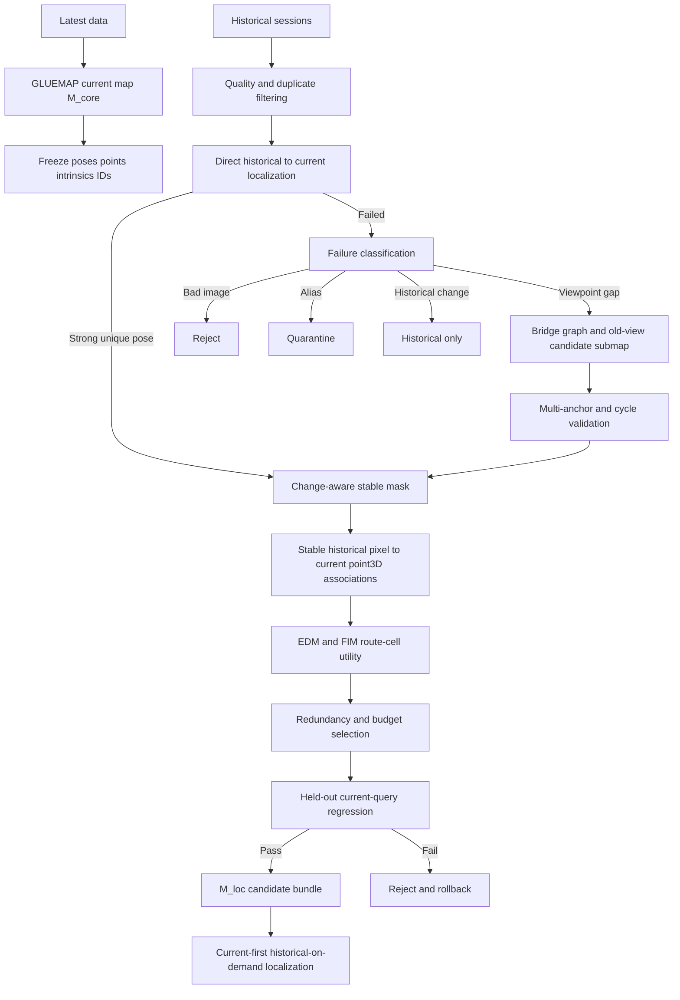

# update_map

針對 **GLUEMAP 建立的最新基本地圖**，以歷史／舊資料補充仍然有效的觀測視角，並供 **EDM detector-free matching + PnP** 定位使用的研究與實驗框架。

本專案的核心不是把所有舊影像重新丟回 SfM，而是實作以下不對稱更新原則：

> **最新資料決定幾何真值；歷史資料只補充目前仍有效的 viewpoint、appearance 與 2D–current-3D observations。**

形式化地說：

\[
M = M_{core} + M_{loc}
\]

- `M_core`：最新資料建立的 GLUEMAP / COLMAP reconstruction，**唯讀且不可漂移**。
- `M_loc`：可更新的 EDM localization layer，保存 current 與 historical references、stable masks、2D–3D associations、bridge provenance、stability 與 route-cell utility。

正常更新必須滿足：

\[
\Delta X^{current}_j = 0,\qquad \Delta T^{current}_i = 0
\]

且歷史資料不得直接建立 production geometry：

\[
\text{historical-only images}\rightarrow\text{new production point3D}
\quad\text{禁止}
\]

---

## 主要能力

- 讀取 COLMAP/GLUEMAP 的文字或 binary sparse reconstruction。
- 建立 base-map SHA-256 snapshot，更新前後驗證基本地圖未被修改。
- 掃描 current map、current validation、historical update sessions，建立不可混淆的資料 manifest。
- 評估 blur、曝光、飽和、entropy 與近重複影格，進行 historical keyframe 篩選。
- 將 EDM 2D–2D matches 安全提升成 historical-query 2D–current-3D correspondences。
- 排除 virtual BA-only tracks、changed pixels、uncertain pixels與重複 point3D IDs。
- per-reference PnP、SE(3) pose clustering、multi-modal fail-closed、非線性 pose refinement。
- 計算 reprojection、凸包、4×4 occupancy、正深度、FIM、pose covariance 與 LOO stability。
- change-aware stable mask：支援 precomputed masks、aligned-image baseline 與可插拔 dense-feature backend。
- image graph、current point-ID propagation、可信 bridge path、多路徑／多 anchor cycle gate。
- Umeyama / RANSAC Sim(3) 對齊與 fixed-current anchored pose-graph optimization。
- route-view cell、EDM front-end utility、FIM utility、K-cover 與 redundancy-aware reference selection。
- ExMaps 類 stability history，但預設只懲罰重複幾何衝突，不因單次 unmatched 或資料年齡直接淘汰。
- E0–E5 主實驗與 A1–A11 ablation protocol 定義、結果比較與 promotion gates。
- synthetic end-to-end demo 與 invariants regression tests。

---

## 系統流程



---

## 安裝

```bash
git clone https://github.com/1122-gggggg/update_map.git
cd update_map
python -m venv .venv
source .venv/bin/activate
pip install -e ".[dev]"
```

若要直接讀取更多 pycolmap 物件：

```bash
pip install -e ".[dev,colmap]"
```

若要自行實作 DINOv2 feature change backend：

```bash
pip install -e ".[dev,dino]"
```

---

## 快速驗證

```bash
pytest
update-map synthetic-demo --output runs/synthetic_demo
```

Synthetic demo 會建立一個固定 current map、正確 historical direct view、可信雙 anchor bridge、alias bridge、changed observation 與 historical-only geometry，並驗證：

- current map hash 不變；
- 正確 stable observations 可被接受；
- changed / uncertain observations不進 PnP；
- multi-modal pose被拒絕；
- single-anchor bridge不能 promotion；
- historical-only points不能進 production geometry；
- selection優先補 weak route cells。

---

## 實際資料目錄建議

```text
workspace/
├── base_map/                  # 最新資料建立的 GLUEMAP/COLMAP map
│   ├── cameras.bin|txt
│   ├── images.bin|txt
│   └── points3D.bin|txt
├── current_validation/       # 不參與建圖的最新 session
│   ├── flight_001/
│   └── flight_002/
├── historical_updates/
│   ├── old_session_001/
│   ├── old_session_002/
│   └── old_session_003/
├── edm_precomputed/          # 可選：既有 EDM pipeline輸出
│   ├── retrieval.json
│   └── matches/
└── runs/
```

建立資料盤點：

```bash
update-map audit \
  --base-map workspace/base_map \
  --historical workspace/historical_updates \
  --validation workspace/current_validation \
  --output runs/audit
```

建立／驗證基本地圖 snapshot：

```bash
update-map hash-map workspace/base_map --output runs/base_map_hashes.json
update-map verify-map workspace/base_map runs/base_map_hashes.json
```

---

## EDM 與既有定位系統接法

本 repository 不綁死某一個 EDM fork 或 HLoc 專案路徑。核心 pipeline 接受標準化 adapter，避免把研究邏輯和特定模型程式碼耦合。

支援三種方式：

1. **Precomputed adapter**：讀取現有 EDM retrieval/match 結果，最適合先重現既有系統。
2. **Python callable adapter**：設定 `module:function`，直接呼叫既有 Python API。
3. **External command adapter**：以 command template 呼叫既有 EDM CLI，再讀取標準 `.npz`。

單一 query-reference pair 的標準 `.npz`：

```python
query_xy      # [N, 2], float
reference_xy  # [N, 2], float
confidence    # [N], float in [0, 1]
sigma         # [N] or [N, 2], optional
```

retrieval JSON：

```json
{
  "queries/000001.jpg": [
    {"reference": "map/ref_000123.jpg", "score": 0.91},
    {"reference": "map/ref_000441.jpg", "score": 0.84}
  ]
}
```

完整 contract 見 [`docs/data_contracts.md`](docs/data_contracts.md)。

---

## 實驗配置

預設設定：

```bash
cp configs/default.yaml configs/local.yaml
```

修改：

```yaml
paths:
  base_map: /absolute/path/to/base_map
  historical_data: /absolute/path/to/historical_updates
  current_validation: /absolute/path/to/current_validation
  precomputed_edm: /absolute/path/to/edm_precomputed
  output_root: /absolute/path/to/runs
```

執行 protocol：

```bash
update-map run-protocol --config configs/local.yaml
```

當尚未接入 EDM adapter 時，可先執行：

```bash
update-map validate-config --config configs/local.yaml
update-map audit --config configs/local.yaml
```

---

## 主實驗

| ID | 實驗 |
|---|---|
| `E0_BASE_CURRENT_ONLY` | current GLUEMAP + current EDM references |
| `E1_DIRECT_NO_CHANGE_MASK` | 加入 direct historical refs，但不做 change mask；只作風險 ablation |
| `E2_DIRECT_CHANGE_AWARE` | direct refs + stable-mask filtering |
| `E3_DIRECT_VERIFIED_BRIDGE` | E2 + multi-anchor/cycle-verified bridge refs |
| `E4_SELECTED_AUGMENTED` | E3 + EDM/FIM/K-cover utility selection與去冗餘 |
| `E5_PRODUCTION_CANDIDATE` | current-first historical-on-demand + source-aware PnP + fail-closed multimodality |

Ablation A1–A11 定義於 [`docs/experiment_protocol.md`](docs/experiment_protocol.md)。

---

## Hard invariants

任何 production candidate 必須全部通過：

1. 基本地圖 hashes 完全不變。
2. current camera poses、point3D coordinates、intrinsics與IDs不變。
3. historical-only point永不進 production geometry。
4. virtual BA-only track不得用於 PnP。
5. changed與uncertain mask pixels不得進 PnP。
6. point3D inliers必須去重。
7. multi-modal pose必須 fail-closed。
8. single weak anchor bridge不得 promotion。
9. healthy common-success query新增 false rejection目標為 0。
10. confident wrong pose不得增加。
11. 既有 common-success inlier non-regression gate預設維持 5%。
12. weak/worst-decile route cells或最大連續失敗區域必須有可量測改善。
13. 所有輸出是 sidecar/candidate bundle，不覆蓋原始 production map。

---

## 文獻對應

本實作將不同論文的可用原理放到不同模組，而不是聲稱任何一篇論文直接提出完整 GLUEMAP→EDM 更新系統：

- Multi-Session SLAM with Differentiable Wide-Baseline Pose Optimization：wide-baseline session connection、Sim(3)、pose graph。
- Multi-View Pose-Agnostic Change Localization with Zero Labels：pose-aligned、多視角、feature/structure change localization。
- RTMap：matched/outdated/new 分流與 change-aware localization。
- Long-term Visual Map Sparsification with Heterogeneous GNN：future-query utility、K-cover、map budget。
- Predictive and Adaptive Maps：privileged experience、防止逐代漂移、history-aware update。
- ExMaps：長期 visibility/stability 與 exponential decay。
- Map Point Selection for Visual SLAM：後端 information utility 必須和前端可匹配性共同考慮。

完整連結與本專案採用範圍見 [`docs/literature_mapping.md`](docs/literature_mapping.md)。

---

## 目前邊界

- Repository 提供完整 research orchestration、幾何、gates、bridge、selection、reports與 adapters；EDM model weights、GLUEMAP、原始資料不納入版本庫。
- Dense DINOv2 change inference 和真正 scene rendering依使用者的現有模型／幾何資產接入；repository 同時提供可執行的 aligned-image baseline 與 precomputed-mask adapter。
- 若沒有獨立 current validation session，系統會標記 `PROVISIONAL_PROXY_VALIDATION`，不得把結果宣稱為 production 泛化改善。
- Bridge 能證明歷史影像相對 current map 的連接，但不能證明場景未變；bridge後仍必須重跑 change detection。

---

## 開發命令

```bash
pytest
pytest --cov=update_map --cov-report=term-missing
ruff check .
python scripts/validate_environment.py
```

## Candidate promotion 與回滾

實驗輸出不得直接覆蓋 production。先 stage：

```bash
update-map stage-bundle output/edm_bundle_augmented_candidate \
  --version 2026-08-18-e5 \
  --registry workspace/bundle_registry \
  --base-map workspace/base_map
```

只有 regression report 內 `passed=true` 才能 promotion：

```bash
update-map promote-bundle \
  --version 2026-08-18-e5 \
  --regression-report runs/e5/regression.json \
  --registry workspace/bundle_registry \
  --base-map workspace/base_map
```

回滾不改動 GLUEMAP，只切換 active sidecar pointer：

```bash
update-map rollback-bundle \
  --registry workspace/bundle_registry \
  --base-map workspace/base_map
```

資料盤點可加 `--check-content-hashes`，偵測 current-map 與 validation 影像即使改名後仍為同一張的資料洩漏。
