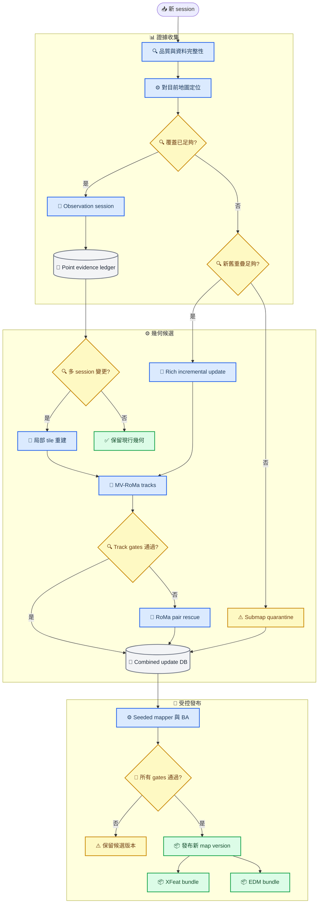

# GLOMAP／GlueMap 長期地圖更新策略紀錄

_適用於 `sfm_system` · 研究與架構紀錄 v2 · 2026-07-15_

---

## 📋 摘要

本專案應把「幾何地圖更新」與「飛行時定位 matcher」拆成兩層。唯一的幾何真相來源是版本化的 COLMAP sparse model、相容的 feature/match database、影像、標定及 session evidence；XFeat＋LightGlue 與 EDM 都只是由同一版已驗收幾何地圖產生的部署 adapter。這樣即使日後更換定位 matcher，也不必重做或污染地圖歷史。

日常更新採兩種 session：若新資料已能穩定定位，僅記錄 observation statistics，不重複加入同一幾何；若既有地圖覆蓋不足但仍有足夠新舊重疊，才建立 rich session，計算 `new-new` 與 `new-old` 增量匹配、三角化新 tracks，並以固定舊 frames 的 seeded incremental mapper 執行 bundle adjustment。低重疊子地圖及疑似場景變更先進 quarantine，不允許只靠一次 Sim3 或一次拍攝就覆蓋正式地圖。

目前建議是：rich update 以 **MV-RoMa multi-view tracks** 為主要幾何前端，RoMa v2 作低重疊或 group failure 的 pair-wise rescue；舊 map 的 `points2D` indices 必須固定，新影像才做 aggregation。定位端同時產生 **XFeat 與 EDM bundle**：XFeat 暫作低延遲 fast path，EDM 作 recovery 與候選主路徑，待同一 final map、held-out 影片、PnP gate 與 ground truth／明確 proxy 的 bake-off 再定案。

**狀態：** 本文件是設計與決策紀錄；尚未實作新的 canonical update database、point-level stability ledger 或 local tile replacement。

## 🔍 現況與問題定義

### 現有更新程式不是完整 SfM 更新

目前的 [`map_update_tool.py`](./source/sfm_reshot25/update_pipeline/map_update_tool.py) 有兩條主要路徑：

| 路徑 | 實際行為 | 幾何限制 |
| --- | --- | --- |
| `register` | PnP 新 frame，沿用舊 3D anchors，加入定位 reference | 不增加新 3D 點，不做 joint BA |
| `submap` | 新影像獨立建圖，以 bridge camera centers 做 Umeyama Sim3 | 未把新舊觀測放回同一圖做 joint BA |

最近產物的實際結果記錄在 [`update_report.md`](./outputs/verify_update_20260702_tracking_skip_p122/update_report.md)：P121 新增 76 references、0 新點；P124／P125 是 Sim3 子圖，其中 P125 僅有 2 個 geometry bridges，該次又關閉 `bridge_gate_quality`。這適合做候選資料或外觀覆蓋，不能視為已驗收的幾何更新。

現有 [`stability_scores.py`](./source/sfm_reshot25/update_pipeline/stability_scores.py) 是 **reference-level** 分數：舊 reference 每個 update session 衰減，近期 hit 增加分數。ExMaps 的核心則是 **3D point-level** visibility／recency stability；兩者用途不同，不能以現有 `ref_stability` 宣稱已完成 ExMaps。

### 資產可重現性目前不足

[`update_pipeline.py`](./pipeline/update_pipeline.py) 預設的 base model、base images、bundle 與 MegaLoc cache 已不在原路徑；`megaloc_cache.py` 仍引用已搬移的 shared module。最新 `outputs` 主要是 `.pt` bundle、PLY 與報告，沒有完整可 append 的 database／sparse model，因此無法從該產物繼續高可信 SfM 更新。

在恢復以下 map snapshot contract 前，不應把任何更新標成 production：

- 原始 sparse model：`cameras`、`images`、`points3D`
- 與 model observation indices 相容的 keypoints／matches database
- 原始或可重建特徵的 reference images
- local／global feature caches、MV-RoMa／RoMa raw matches 與 matching group／pair graph
- 固定標定、工具版本、參數與輸入檔 hash
- MV-RoMa、UFM prior、RoMa v2 的 checkpoint／source revision 與 group manifest
- point/session evidence、候選變更與 release QA
- XFeat／EDM 各自的 deployment bundle

### 本機 MV-RoMa、XFeat 與 EDM 現況

本機已存在 [`MV-RoMa`](../建圖/external_tools/MV-RoMa/README.md) 官方程式、outdoor checkpoint，以及 shard resume／content attestation／aggregation 測試，例如 [`test_mvroma_resume.py`](../建圖/pipeline/test_mvroma_resume.py) 與 [`test_mvroma_attestation.py`](../建圖/pipeline/test_mvroma_attestation.py)。這表示 MV-RoMa 已具備離線建圖前端基礎，但目前的 `更新地圖` updater 尚未完成「舊 `points2D` 固定、old-side snapping、只 append 新 tracks」的 incremental contract。

EDM 已不是抽象候選；本機 [`build_reloc_map_edm.py`](../EDM定位測試/build/build_reloc_map_edm.py) 實作了 detector-free EDM 的固定姿態重三角化。它以 `round(keypoint / 8)` 建立穩定 coarse-cell identity，將 reference cell 映射到 3D，並把 reference JPEG 直接放進 bundle。這是合理的 EDM localization adapter，但它保持原 pose 不動，仍不是地圖幾何更新器。

河濱同 1,895 frames 實測見 [`bench_stream.log`](../EDM定位測試/outputs/bench_stream.log)：

| 指標 | EDM | XFeat baseline |
| --- | ---: | ---: |
| 接受 poses | 1,893／1,895 | 1,895／1,895 |
| median total latency | 28.3 ms | 16.2 ms |
| median match latency | 21.6 ms | 5.9 ms |
| median PnP inliers | 476 | 未在該表列出 |
| EDM 與 XFeat pose 差 | 0.0146 map-unit／0.286° | 比較基準 |

這個 pose difference 只是兩方法的一致性，不是 ground truth accuracy。相同河濱 map 的 bundle 大小約為 XFeat 288 MB、EDM 210 MB，但兩者內容不同，不能只用檔案大小選擇方法。

舊 target-site EDM bundle 的完整影片結果見 [`final_verify.log`](../EDM定位測試/outputs/final_verify.log)：P123 為 71.3%，P126 為 87.4%，都低於 [`TARGET_SITE_GLUEMAP_EDM_PLAN.md`](../docs/TARGET_SITE_GLUEMAP_EDM_PLAN.md) 的 S9 `>=95%` gate。該 target-site 新 GlueMap 正在重建，檢查時 `gates/S0_S3_release.json` 尚未生成；舊 recovered-map 結果不可當新地圖的最終判決。

## 📚 研究結論與可移植機制

| 工作 | 核心機制 | 適合移植到本專案 | 不應直接照搬 |
| --- | --- | --- | --- |
| Bürki et al. | 定位差時加入 rich session；定位好時只加 observation session；之後 summarization 控制 map size[^1] | 更新門控、避免重複資料、appearance coverage、固定容量 | 論文的輪速計 RMS threshold 不能直接當無尺度 SfM 門檻 |
| Halodová et al. | 比較 static、latest、multiple、score-based、FreMEn；時間模型與漸進替換較好，盲目 latest-map 會累積漂移[^2] | session tag、只懲罰真正錯配、漸進替換、保留 privileged base | 資料不足時就擬合週期模型；將「未匹配」一律視為過期 |
| ExMaps | 依 3D 點的可見性與最近觀測時間做 exponential decay，將穩定度用於 progressive sampling／PROSAC[^3] | point-level stability、recency、穩定點優先 PnP | 只做 reference-level decay；未先判定 should-be-visible 就扣分 |
| RTMap | 同時預測 matched／outdated／new，將 change detection 與 localization 緊密耦合，並以 uncertainty 做多 traversal 融合[^4] | 三態 evidence、uncertainty、runtime 收證據／backend 非同步發布 | 它是向量化 HD map＋多感測器 BEV 模型，不是 sparse SfM drop-in module |
| SceneEdited | 將 2D change evidence 投影回 3D，分開評估點新增與移除，要求可追蹤的 city-scale update benchmark[^5] | 變更 mask、addition/removal 分開、multi-view confirmation、局部 3D QA | 它主要是 LiDAR point-cloud HD map benchmark；沒有 LiDAR 時不可假設同等 observability |
| MV-RoMa | 以一張 source 與多張 co-visible targets 聯合估計 dense correspondences，直接形成 multi-view-consistent tracks；ETH3D 與困難 SfM 評估優於 pair-wise RoMa[^6] | rich update、跨 session tracks、低紋理與稀疏視角幾何；限制 group budget 後只處理包含新影像的 groups | 當成即時單幀定位器；未 snap 到舊 `points2D` 就直接 append；把論文 from-scratch SfM 結果視為 long-term update 證明 |
| EDM | detector-free semi-dense matching；深層 correlation 與 coarse-to-fine regression；官方 matching 指標常高於 SuperPoint＋LightGlue，但完整 localization 是有輸有贏、作者結論為 comparable[^7] | EDM cell→3D runtime adapter、XFeat weak/lost recovery、候選 production matcher | 由 `EDM > SuperPoint+LightGlue` 推導 `EDM > XFeat+LightGlue`；把 pair-specific EDM 點直接當普通 per-image descriptor table |

研究對架構的直接影響是：新 session 不只有「加入／不加入」兩種結果；它還可以只更新統計、提供負面證據、進入候選區，或觸發局部重建。正式 sparse map 必須保持可回滾，runtime evidence 不得直接覆寫 production model。

## ⚙️ 推薦更新架構



### 地圖資料分層

建議每個 release 使用以下目錄契約：

```text
map_versions/v004/
├── manifest.json
├── geometry/
│   ├── sparse/
│   └── update.db
├── sessions/
│   └── 2026-07-15_Pxxx/
├── evidence/
│   ├── point_stability.npz
│   ├── session_observations.json
│   └── change_candidates.json
├── qa/
│   ├── geometry_report.json
│   └── localization_report.json
└── deployment/
    ├── reloc_xfeat.pt
    └── reloc_edm.pt
```

`geometry/` 是唯一 canonical truth；`deployment/` 可丟棄重建。禁止從某個 `.pt` bundle 反向推定或更新 canonical geometry。

### Session 分流

1. **Observation session**：定位成功率、inliers、空間覆蓋與軌跡連續性均足夠。只更新 point visibility、co-observation、appearance/session tag 與 reference usefulness，不加入近重複 frames。
2. **Rich incremental session**：既有圖對新條件覆蓋不足，但新舊之間仍有分布良好的 bridges。以新影像為 source，搭配 2–4 張 co-visible old／new targets 建立 MV-RoMa groups，保留雙向一致性與空間覆蓋良好的 multi-view tracks。只計算包含新影像的 `new-new`、`new-old` groups／pairs，重用全部 `old-old` database；group failure 再交給 RoMa v2，最後三角化跨 session tracks 並做 anchored BA。
3. **Low-overlap submap**：先獨立建候選子圖。Sim3 必須使用 RANSAC、空間分散的 bridge clusters 與 scene-scale-normalized residual；合併後仍要 joint BA。未通過前保持 quarantine。
4. **Changed-region session**：同一區域有多個獨立 session 支持 addition／removal 才進局部 tile 重建；單次遮擋、不同觀看方向或 matcher failure 只算弱證據。

### 重送原始建圖資料時

若輸入是當初建立目前地圖的同一批影像，正確結果應接近 **no-op**，而不是把它當成新的長期觀測：

- content hash 相同的影像直接對應既有 image／session identity，不新增 image ID、3D point 或 positive evidence
- 近重複影像由 global descriptor、時間資訊與幾何 overlap gate 擋下，不可因重新命名檔案就變成新 session
- 不更新 `last_seen_session`、stability 或 appearance coverage；否則同一批舊資料會讓過期點被永久「續命」
- 不把重送資料放入 held-out localization set；否則成功率、inliers 與 regression 指標會有 test leakage

如果刻意改用 MV-RoMa／RoMa v2 重新匹配原始影像，這可以補 graph edges、重新三角化或改善 BA，但它屬於 **controlled rebuild／reprocessing**，不是 incremental update。應建立新的 candidate map version，固定相同 image set 與標定，比較重建前後的 reprojection、完整性、舊相機漂移與 held-out localization；通過 gates 後才能取代 production map。若把同一影像複製成新 IDs，零或極小 baseline 的重複觀測會過度加權相同 evidence、膨脹 reference 數與 track count，卻不會增加真正的視角或時間資訊。

### Point-level evidence ledger

每個 3D point 至少保存：

| 欄位 | 意義 |
| --- | --- |
| `point_id`／persistent UUID | 不依賴會重編號的 COLMAP point ID |
| `first_seen_session`、`last_seen_session` | 存活時間與最近觀測 |
| `visible_sessions`、`matched_sessions` | should-be-visible 與實際匹配分開 |
| `positive_weight`、`negative_weight` | 正、負證據累積 |
| `stability` | session-based exponential decay 後分數 |
| `state` | `active`、`suspected_stale`、`retired` |
| `semantic_dynamic` | 人、車、樹葉等動態先驗；可選 |
| `region_id` | 局部更新與回滾單位 |

只有當點投影在視野內、深度／遮擋合理、該 frame 本身定位可靠，卻在多個獨立 session 持續無法觀測時，才形成有效 negative evidence。建議以 session 而非 frame 為衰減單位，避免一段長影片對分數重複投票數千次。

初始策略可以沿用 exponential decay，但 half-life 必須由 held-out localization sweep 決定。FreMEn／週期性預測要等累積足夠月份、日夜或季節循環後再加入；目前先記錄 `captured_at`、天候、月份、時段及拍攝方向即可。

## 🔧 GLOMAP 與 GlueMap 的落地方式

### 已有 GLOMAP／COLMAP map

若原始 database 仍存在，例行更新採：

1. 複製上一版 database 與 sparse model 成 candidate version
2. append 新 images、固定 camera IDs／intrinsics
3. 只匯入 `new-new` 與 `new-old` verified multi-view tracks／rescue matches
4. 以舊 sparse model 作 `--input_path`
5. 固定舊 frames 與已知內參，註冊、三角化並 BA

```bash
colmap mapper \
  --database_path map_versions/v004/geometry/update.db \
  --image_path images_all \
  --input_path map_versions/v003/geometry/sparse \
  --output_path map_versions/v004/candidate_incremental \
  --Mapper.fix_existing_frames 1 \
  --Mapper.ba_refine_focal_length 0 \
  --Mapper.ba_refine_principal_point 0 \
  --Mapper.ba_refine_extra_params 0
```

COLMAP 官方建議快速定位可用 `image_registrator`；若要更準並加入 triangulation，應以 mapper 載入既有 reconstruction[^8]。GLOMAP 的獨立 repository 已 deprecated，global mapper 已移入 COLMAP；它仍以完整 database graph 做全域求解[^9]。

每累積數批、跨 session connectivity 顯著改變或新影像比例已高時，再對 combined database 執行 `global_mapper`。它會重解全域 gauge，因此輸出必須以穩定舊 cameras、GCP 或 RTK 做 robust Sim3 對齊，再生成 deployment bundles。GLOMAP／GlueMap 已有 global BA，不再加一層低維 pose-graph optimization。

### 已有 GlueMap map

GlueMap 是全域 feed-forward reconstruction＋global refinement／augmented BA pipeline，支援 stage rerun，但沒有原生 append-existing-map contract[^10]。本機 `database_merged.db` 的 keypoints 與最終 `gluemap_aba` 相容，但 descriptors 為空；不能直接拿來執行需要 descriptors 的 matcher。

建議做一次 canonicalization：

1. 以 `gluemap_aba` poses 與固定 intrinsics 作幾何 seed
2. 將既有 sparse model 的每張影像 `points2D` 依原順序匯出為 fixed-reference feature H5，保留 observation indices
3. 將相容的舊 database／matches 納入 canonical update DB；若原 database 不完整，從 model observations 建立可追溯的最小基底
4. 以 retrieval 和時序鄰居將新影像組成「一張新 source＋2–4 張 old／new targets」的 MV-RoMa groups
5. 將 old-side MV-RoMa 座標 snap／assign 到固定舊 `points2D`，只對新影像 keypoints 做 aggregation；不重新量化舊圖
6. 對 group failure 或只剩 pair-wise overlap 的 edges 執行 RoMa v2 rescue，再匯入 verified tracks／matches
7. 固定舊 poses 重三角化、執行 seeded mapper／BA；正式 release 後，再由同一 model 分別重建 XFeat 與 EDM bundle

不要在影像集合改變後盲目使用 GlueMap `force_load=True`；目前 cache 只看檔案是否存在，沒有完整 image-list／hash validation，可能載入舊影像集合結果。

### 地圖更新 matcher 建議

地圖更新與 runtime localization 使用不同契約，建議分工如下：

| 層級 | 主路徑 | 備援／候選 | 關鍵契約 |
| --- | --- | --- | --- |
| Retrieval | SALAD／MegaLoc＋時序鄰居 | 人工 bridge pairs | 只建立高 overlap groups，不做 all-pairs |
| Rich geometry update | MV-RoMa source＋2–4 targets | RoMa v2 pair rescue | 舊 `points2D` 固定；只 append 新 keypoints／tracks |
| Observation-only update | 目前 production localizer | EDM recovery | 只更新 evidence，不新增幾何 |
| Runtime localization | XFeat fast path | EDM recovery／候選主路徑 | 各自建立 bundle 與 PnP hypothesis |

這裡的「抽特徵」需要區分兩種介面。XFeat／SuperPoint 類方法通常輸出可跨多個 pair 重用的 per-image keypoints 與 descriptors；RoMa v2 是 pair-wise dense correspondence model，MV-RoMa 則把一張 source 與多張 targets 的初始匹配精煉成一致 tracks。後兩者更適合作為 **幾何 correspondence frontend**，不是直接替換 COLMAP descriptor table 的一般 feature extractor。它們的輸出仍必須經 confidence／consistency filtering、NMS、track aggregation，並在 old side 對齊既有 `points2D` identity，才能安全寫入 canonical database。

MV-RoMa 相較 pair-wise RoMa 的價值不是單純產生更多 matches，而是直接生成跨多張影像一致的 tracks。論文預設先以 UFM pair matches 建立 track tokens，一個常用 group 是一張 source 加四張 targets；本機已有 UFM／MV-RoMa 整合與 outdoor weight，因此 rich session 應優先延續這個契約。它仍不是原生 long-term map updater：若沒有 old-side snapping、固定 feature indices、雙向 consistency、confidence filtering 與 track NMS，就不能安全併入既有圖。

官方 ETH3D Type-A 比較中，MV-RoMa 相對 RoMa 的 1 cm accuracy 由 75.58 提升至 81.91，5 cm completeness 由 38.60 提升至 41.22；但和完整 `RoMa + Dense-SfM` 比較時，MV-RoMa 的 1 cm accuracy 為 85.88 對 84.79，5 cm completeness 則是 23.81 對 36.35。因此它更像高一致性 track frontend，不保證最終點數最多。448×448、RTX 6000 Ada 的官方測量中，一次 source-to-five-targets 約 280 ms，仍適合離線更新而非逐幀 runtime localization[^6]。

RoMa v2 保留為以下用途：

- MV-RoMa 無法形成足夠 co-visible group，但個別 `new-old` pair 仍有可用 overlap
- group track gate 失敗時補 bridge edges
- 針對低紋理、重複結構或大視角 pairs 做離線 rescue

XFeat 與 EDM 都不再定義 canonical 幾何 identity。XFeat 作低延遲 runtime fast path；EDM 對相同 top-1／top-2 references 建立 recovery hypothesis，並保留升級為 production primary 的可能。

如果雙 matcher 並用，不要直接把兩種 correspondence 混在同一次 PnP；先各自求 pose，再以 unique 3D anchors、inlier spatial coverage、reprojection、temporal jump 與 prior consistency 選 hypothesis，避免不同 confidence calibration 和重複 3D anchors 造成偏權。

## 🧪 XFeat 與 EDM 決策實驗

EDM 論文確實在多個 matching／localization 指標高於 SuperPoint＋LightGlue，但不是全面勝出[^7]：

| 官方測試 | EDM | SuperPoint＋LightGlue | 判讀 |
| --- | ---: | ---: | --- |
| ScanNet relative pose AUC@5° | 19.8 | 14.8 | EDM 較高 |
| HPatches homography AUC@3px | 68.5 | 54.2 | EDM 較高 |
| InLoc DUC1 @0.25m／2° | 51.5 | 49.0 | EDM 較高 |
| InLoc DUC2 @0.25m／2° | 59.5 | 55.0 | EDM 較高 |
| Aachen Day @0.25m／2° | 89.1 | 90.2 | EDM 較低 |
| Aachen Night @0.25m／2° | 77.0 | 77.0 | 相同 |

這些結果證明 EDM 是有競爭力的 detector-free matcher，但比較對象是 SuperPoint＋LightGlue，不是本專案的 XFeat＋LightGlue／LighterGlue。matching AUC 也不會自動轉成最終定位優勢；retrieval recall、map 3D 誤差、2D→3D association、unique anchors、PnP gate 與 temporal tracker 都可能是 binding constraint。論文作者對 InLoc／Aachen 的總結也是 comparable，而非所有門檻全面領先。

定位 matcher 尚未決定是合理的；目前證據不足以定案。公平 bake-off 必須固定：

- 同一 final sparse map version
- 同一 MegaLoc retrieval candidates
- 同一相機模型與影像 resize contract
- 同一 held-out sessions，且不得參與 mapping／bundle tuning
- 同一 PnP error、minimum inliers、jump gate 與 failure definition
- 同一 point/reference stability prior

需要輸出的比較指標：

| 類別 | 指標 |
| --- | --- |
| 正確性 | RTK／GCP translation error、rotation error；沒有真值時明確標為 proxy |
| 可用性 | localization rate、false localization rate、最大連續 failure、lost recovery time |
| 穩定性 | step p50／p95、teleport count、反向飛行與轉彎表現 |
| 長期性 | 跨日期、日夜、季節、場景變更分組結果 |
| 效率 | latency p50／p95、FPS、VRAM、CPU、bundle size、cold-start |
| 幾何支持 | correspondences、inliers、2D spatial coverage、unique 3D anchors |

當前 provisional decision：

| 項目 | 決策 |
| --- | --- |
| Canonical update correspondence | MV-RoMa multi-view tracks；RoMa v2 pair rescue |
| Canonical point identity | 固定舊 `points2D`；只 append 新 keypoints／tracks |
| Production localization | 暫留 XFeat fast path；等待 final-map bake-off |
| EDM | 保留 recovery／experimental primary bundle；有 ground truth 後可升級 |
| Hybrid | 分別求 pose hypothesis，不混合 raw matches |
| 最終判決 | 以 held-out pose accuracy、錯誤定位率、continuity 與 latency gates 決定，不以 inlier 數單獨決定 |

## ✅ Release gates

### 幾何 gates

- 所有輸入、database、model、bundle 與設定都有 hash／parent version
- 新 session 無 test leakage，且重複原始影像被 content hash／near-duplicate gate 擋下
- combined graph 的 connected components、跨 session bridge clusters 與方向分布通過
- MV-RoMa old-side correspondences 已 snap 到既有 `points2D`，舊 observation indices 未被重新量化
- MV-RoMa groups 通過 forward／backward consistency、confidence、空間覆蓋與 multi-view track-length gates
- reprojection p50／p95、track length、triangulation angle、新圖註冊率通過
- 舊地圖座標對齊、scale、穩定 cameras 漂移在允許範圍
- low-overlap submap 已完成 joint BA，而非只完成 Sim3
- fixed intrinsics 確實保持固定，camera width／height 與磁碟影像一致

### 長期更新 gates

- 新點與舊點移除分開記錄，均有 session-level provenance
- 退役 point 至少有多個獨立 session 的有效 negative evidence
- 每個 changed region 有 reprojected multi-view evidence，不以單張 mask 直接刪 3D
- map summarization 後，舊／新 appearance sessions 的 coverage 均未退化
- `ref_stability` 與 point stability 分開保存，不相互冒充

### 定位 gates

- P123、P126 與未參與開發的額外影片分 session 報告
- target-site 延續現有 `>=95%` 成功率 gate，但同時要求 zero ghost teleport 與合理最大連續 failure
- 舊場景 regression set 不可出現新增失敗
- 有 ground truth 時以 translation／rotation error 為主；inliers 只作診斷
- XFeat／EDM 使用同一 release map，分別產出完整結果與失敗 frame 清單

## 🎯 實作順序

1. **P0：恢復 map snapshot contract** — 修正 base paths／MegaLoc import，找回或重建完整 sparse model、images、database 與 manifest
2. **P1：建立 session ledger** — content hash、capture time、方向、appearance tag、parent map、held-out flag
3. **P2：建立 canonical multi-view update DB** — 從 GlueMap／GLOMAP model 匯出固定舊 `points2D`、保留 feature indices，建立可 append 的 database 與 reference H5
4. **P3：導入 MV-RoMa rich session** — UFM priors、source＋2–4 targets、雙向 consistency、track NMS、old-side snapping；失敗 edges 交給 RoMa v2
5. **P4：導入 seeded mapper** — 固定舊 frames／intrinsics、三角化與 anchored BA，取代 bundle-only register 作為正式更新路徑
6. **P5：建立 point evidence ledger** — should-be-visible、positive／negative evidence、ExMaps-style decay、retire quarantine
7. **P6：局部變更更新** — 2D evidence→3D region、multi-session confirmation、boundary-anchored tile rebuild
8. **P7：雙 bundle release** — 從同一 accepted model 產出 XFeat 與 EDM，分別求 PnP hypotheses，再執行公平 bake-off
9. **P8：週期全域整理** — combined DB `global_mapper`、座標重對齊、summary map／appearance coverage pruning

優先順序刻意先處理資料契約與 joint BA，再處理更複雜的 change detector。沒有可重現的 canonical map，任何 stability 或 change model 都沒有可靠的 point identity 可以累積。

## ⚠️ 限制與未決事項

- 目前沒有 RTK／GCP ground truth，因此現有 map-unit pose difference 不能證明絕對定位精度
- `ref_stability` 已有程式但最新部署產物未必包含，且它不是 point-level stability
- target-site 新 GlueMap 尚未完成 S4–S9；本文件不替代其現有 anti-ghost／intrinsics／held-out gates
- SceneEdited 與 RTMap 依賴的 LiDAR／vector HD map supervision 並不存在於目前純影像 sparse SfM；只移植 evidence 與驗收概念
- FreMEn／季節週期模型要等有足夠時間跨度後才有識別性
- MV-RoMa 論文驗證的是 image-group SfM／triangulation，不是既有 map 的 long-term incremental update；本專案仍需實測 old-side snapping、跨 session group selection 與舊圖 regression
- MV-RoMa 需要多張 co-visible targets；低 overlap、單張新影像或 group 無法成立時，必須回退 RoMa v2／既有定位器，不可硬湊 targets
- EDM 的 cell identity 是本機 adapter 的關鍵契約；未經 round-trip、resize 與 multi-resolution gates 不得改 input canvas
- EDM 論文沒有 XFeat＋LightGlue 對照；在本機得到更多 inliers 或與 XFeat pose 接近，都不能取代 ground-truth translation／rotation error

## 🔗 參考資料

逐篇方法、數字與工程邊界的查核摘記見 [`research_map_update_papers_20260715.md`](./sources/research_map_update_papers_20260715.md)。

[^1]: Bürki, M., Dymczyk, M., Gilitschenski, I., Cadena, C., Siegwart, R., & Nieto, J. (2018). “Map Management for Efficient Long-Term Visual Localization in Outdoor Environments.” _IEEE Intelligent Vehicles Symposium_. https://arxiv.org/abs/1808.02658

[^2]: Halodová, L., Dvořáková, E., Majer, F., Vintr, T., Martinez Mozos, O., Dayoub, F., & Krajník, T. (IROS 2019; arXiv 2026). “Predictive and adaptive maps for long-term visual navigation in changing environments.” https://arxiv.org/abs/2603.12460

[^3]: Rotsidis, A., Lutteroth, C., Hall, P., & Richardt, C. (2021). “ExMaps: Long-Term Localization in Dynamic Scenes Using Exponential Decay.” _WACV 2021_. https://openaccess.thecvf.com/content/WACV2021/papers/Rotsidis_ExMaps_Long-Term_Localization_in_Dynamic_Scenes_Using_Exponential_Decay_WACV_2021_paper.pdf

[^4]: Du, Y., et al. (2025). “RTMap: Real-Time Recursive Mapping with Change Detection and Localization.” _ICCV 2025_. https://openaccess.thecvf.com/content/ICCV2025/papers/Du_RTMap_Real-Time_Recursive_Mapping_with_Change_Detection_and_Localization_ICCV_2025_paper.pdf

[^5]: Lin, C.-J., Chin, T.-J., Garg, S., & Dayoub, F. (2026). “SceneEdited: A City-Scale Benchmark for 3D HD Map Updating via Image-Guided Change Detection.” _WACV 2026_. https://openaccess.thecvf.com/content/WACV2026/html/Lin_SceneEdited_A_City-Scale_Benchmark_for_3D_HD_Map_Updating_via_WACV_2026_paper.html

[^6]: Lee, J., Kang, S., & Yoo, S. (2026). “MV-RoMa: From Pairwise Matching into Multi-View Track Reconstruction.” _CVPR 2026_. https://arxiv.org/abs/2603.27542

[^7]: Li, X., Rao, T., & Pan, C. (2025). “EDM: Efficient Deep Feature Matching.” _ICCV 2025_. https://openaccess.thecvf.com/content/ICCV2025/papers/Li_EDM_Efficient_Deep_Feature_Matching_ICCV_2025_paper.pdf

[^8]: COLMAP. “Register/localize new images into an existing reconstruction.” https://colmap.github.io/faq.html#register-localize-new-images-into-an-existing-reconstruction

[^9]: Pan, L., Baráth, D., Pollefeys, M., & Schönberger, J. L. “GLOMAP — Global Structure-from-Motion Revisited.” https://github.com/colmap/glomap

[^10]: Pan, L., et al. “GlueMap — Global Structure-from-Motion Meets Feedforward Reconstruction.” https://github.com/colmap/gluemap

---

_Last updated: 2026-07-15_
